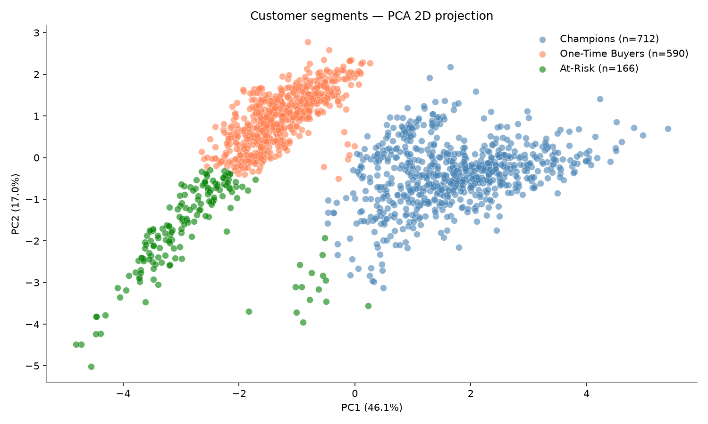
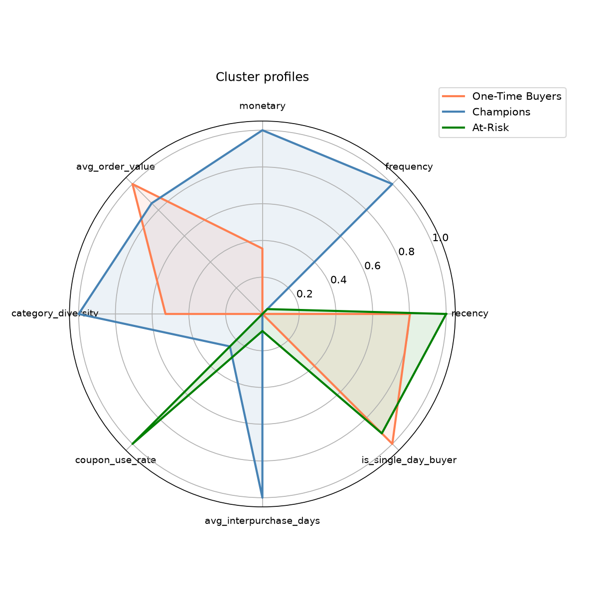

# Customer Segmentation: RFM Scoring vs. K-Means Clustering

Comparing traditional RFM quintile scoring against K-Means clustering on a richer behavioral feature set, to see whether multivariate clustering finds more useful (and more profitable) customer segments than a summed RFM score.

## Why this project

In e-commerce, treating every customer the same wastes marketing budget. This project merges five source tables (customer profile, discounts, marketing spend, online transactions, tax) into one behavioral view of **1,468 customers and ~53,000 transactions** across 2019, then segments customers by actual behavior rather than a single summed score. The goal: test whether clustering on a richer feature set produces more useful segments than traditional RFM quintile scoring, and quantify the difference in dollar terms.

## Data

Five CSVs (`data/`), originally in Korean column names, renamed to English during loading:

| File | Rows | Description |
|---|---|---|
| `Customer_info.csv` | 1,468 | customer_id, gender, region, tenure_months |
| `Onlinesales_info.csv` | 52,924 | line-item transaction log (25,061 unique transaction IDs; multiple product lines per order) |
| `Discount_info.csv` | 204 | monthly coupon codes and discount rates by category |
| `Marketing_info.csv` | 365 | daily offline/online marketing spend |
| `Tax_info.csv` | 20 | GST rate by category |

All 5 tables: 0 missing values, 0 duplicates. All 1,468 customer IDs matched perfectly between the transaction log and the customer profile table.

## Methodology

**1. Outlier investigation: judgment, not deletion.** Quantity max = 900, total_amount max = $10,512. 1,345 transactions (2.5%) were flagged above the 99th percentile, spread across 553 distinct customers, concentrated in the Office category (low unit price, high quantity: a genuine bulk-buying pattern, not an error). Decision: winsorize + log-transform at the customer level rather than drop transactions.

**2. RFM feature engineering, definitions explained, not assumed.**
- **Frequency** = count of unique purchase *days*, not raw transaction count (many customers place multiple line-item orders on the same day; counting unique days avoids inflating "frequent" behavior from single-session browsing).
- **Monetary** = sum of `quantity × unit_price` per customer.
- Frequency and Monetary winsorized at the 99th percentile, then log1p transformed. Recency left as-is (already bounded 1–365 days).
- Extended to **8 features total**: `log_recency`, `log_frequency`, `log_monetary`, `avg_order_value`, `category_diversity`, `coupon_use_rate`, `avg_interpurchase_days`, `is_single_day_buyer`.

**3. Clustering, K selected across 3 metrics.** StandardScaler applied, then K=2 through K=10 evaluated on inertia (elbow), silhouette score, and Davies-Bouldin index simultaneously. Silhouette peaked at K=2 (0.352), K=3 close behind (0.336). K=3 was chosen anyway, a transparent tradeoff: K=2 is the statistically cleanest split but collapses into a binary division with limited business utility; K=3 is the next best across all three metrics and yields actionable segments.

**4. Algorithm validation.** K-Means results were re-run through Agglomerative Clustering (Ward linkage) on the same scaled features. **Adjusted Rand Index (ARI) = 0.876** between the two independent algorithms, confirming the cluster structure exists in the data itself rather than being an artifact of K-Means' spherical-cluster assumption.

**5. Comparison against traditional RFM scoring.** Built a traditional quintile-based RFM score (R+F+M summed 1–5 each, thresholds at 12+ = Champions, 8+ = Dormant, below = At-Risk) and compared it against the K-Means segments. Agreement rate: only **49.2%**. The most consequential disagreement: 335 customers that traditional RFM scored as "low value" were correctly identified by K-Means as high-value repeat buyers, representing a combined **$879,941** in revenue that a simple point-sum model would have deprioritized.

*Caveat: the traditional RFM cutoffs (12/8) are arbitrary choices, so this specific dollar figure is sensitive to where those cutoffs are drawn. It's best read as "K-Means classified this money differently than one reasonable RFM cutoff scheme," not as an absolute measure of RFM's flaws in general.*

## Results

| Segment | Customers | % of total | Revenue share | Avg Recency | Avg Frequency | Avg Monetary |
|---|---|---|---|---|---|---|
| Champions | 712 | 48.5% | 74.9% | 112 days | 3.3 days | $4,654 |
| One-Time Buyers* | 590 | 40.2% | 24.7% | 173 days | 1.0 days | $1,849 |
| At-Risk | 166 | 11.3% | 0.4% | 188 days | 1.1 days | $107 |

\* Relabeled from the notebook's original "Dormant Spenders"; see [Notes](#notes-on-segment-naming) below.

Model fit: Silhouette 0.336, Davies-Bouldin 1.231 (K-Means). PCA 2D projection explains 63.0% of variance (PC1 46.1% + PC2 17.0%).




## Interpretation

- **Champions** (48.5% of customers) generate 75% of revenue, a classic Pareto pattern. Their ~66-day average repurchase interval is a concrete, actionable number: re-engagement campaigns timed around the 60-day mark align with this group's natural buying rhythm.
- **At-Risk** customers are 11% of the base but only 0.4% of revenue. Heavy investment in win-back campaigns here is unlikely to pay off; this group is more useful as a baseline for what low-engagement acquisition looks like.
- **One-Time Buyers** spent a meaningful amount in a single visit (avg $1,849) but never returned. The priority isn't "win-back"; it's understanding why the first purchase didn't convert into a second one.

## Notes on segment naming

The original notebook labeled this segment "Dormant Spenders," which implies a customer who used to return and stopped. The actual profile shows 98.8% of this segment are single-purchase customers (`is_single_day_buyer` = 0.99). They never had a repeat-purchase pattern to begin with. This repo relabels it **"One-Time Buyers"**, because the marketing response is completely different: win-back messaging (implying "come back") versus first-purchase conversion messaging (implying "come back for the first time"). The notebook itself keeps the original label as originally run; the corrected label is used in this README and in the regenerated charts under `images/`.

## Limitations

- **PCA visualization has real limits.** The 2D projection explains only 63% of variance, and the K-Means silhouette score (0.336) is "weak to moderate" by convention. The clusters are real (confirmed via ARI cross-validation) but the boundaries in 8-dimensional feature space are not as crisp as the 2D scatter plot might visually suggest.
- **No external/temporal validation.** As an unsupervised method, there's no ground truth to check against. A natural next step would be checking whether these segments predict actual next-quarter behavior (repeat purchase, churn, LTV).
- K=3 was chosen over the statistically-favored K=2 for business utility (a reasonable, transparently-stated tradeoff), but K=4/K=5 (which might split Champions into narrower sub-segments) wasn't explored beyond the elbow plot.

## Conclusion

K-Means (8-feature behavioral set, K=3) is the better choice for production use, and traditional RFM quintile scoring should be retired.

- **K-Means vs. Agglomerative**: not really competitors. ARI of 0.876 confirms they converge on nearly the same structure. Agglomerative served as validation, not a deployment candidate; it doesn't scale as well as the customer base grows (O(n²)+).
- **K-Means vs. traditional RFM**: this is the real comparison, and K-Means wins on evidence. Traditional RFM reduces customer behavior to three numbers summed into one score, which can conflate very different behavior patterns into the same bucket. K-Means considers 8 dimensions simultaneously and caught $879,941 in customer value that a summed-score model would have deprioritized.
- The real driver of the improvement was **feature engineering, not the algorithm**. K-Means and Agglomerative gave essentially the same answer on the same 8-feature set: the choice of algorithm mattered far less than the choice to model customers on 8 behavioral dimensions instead of 3 summed RFM points.

## Repo structure

```
customer_segmentation/
├── README.md
├── notebook/
│   └── Customer_Clustering_Project.ipynb   # full analysis, as run
├── data/                                    # source CSVs
└── images/                                  # regenerated charts (relabeled segment)
```

## Tech stack

Python, pandas, NumPy, scikit-learn (KMeans, AgglomerativeClustering, PCA), SciPy (winsorize), Matplotlib, Seaborn
